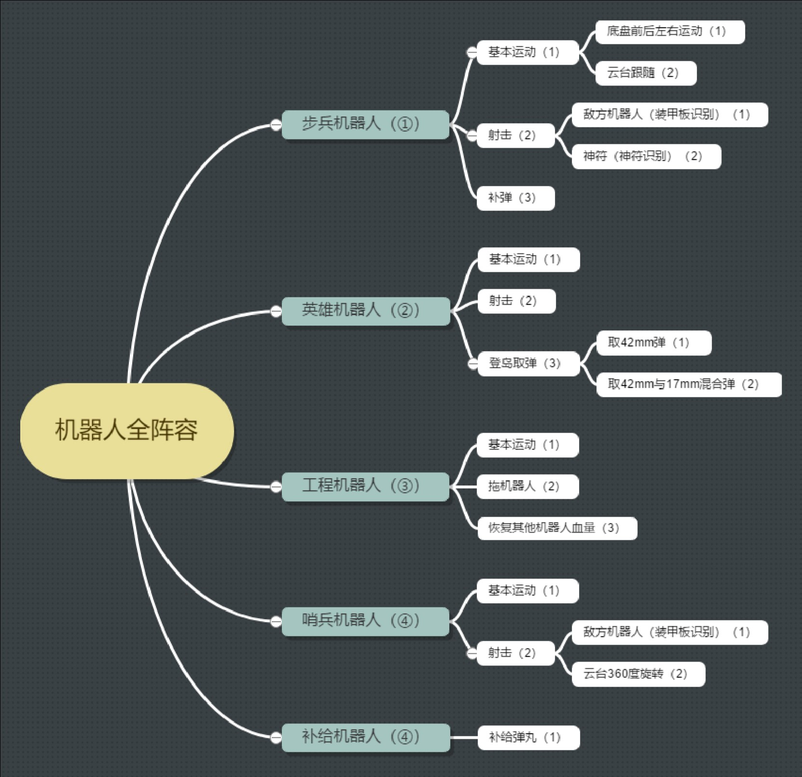
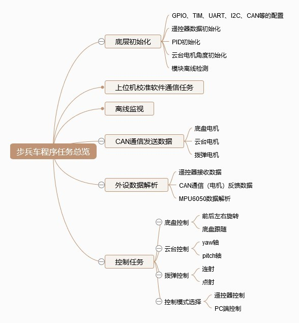
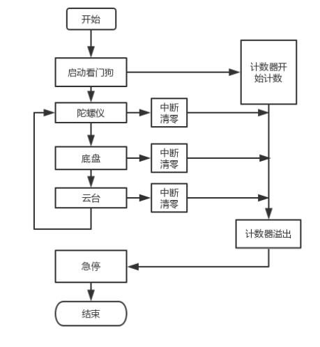

# 前言

南工骁鹰战队于 2018 年 5 月 8 日-2018 年 5 月 11 日参加 Robomaster2018 机甲大师赛南部佛山分区赛。先后对战上海第二工业大学、北京理工大学珠海学院、仲恺农业学院。共 7 局比赛，胜 1 平 1 负 5，未进入小组赛前 16 强。 

此次比赛凸显出了严重的问题，不论是人员上、技术上，还是管理上、进度上都存在很大的问题。本次比赛留下的是血和泪的教训，沉淀下来的技术的积累，望后届人认真阅读，勿复走错路。 

上一届（RM2017）比赛的总结主要偏向经验，加上上一届比赛的技术主力为研究生，所以技术并没有很好的传承下来，这一届的技术几乎是白手起家。但与此同时，在大疆官方组委会的努力下，每一年关于大赛的资料越来越多，可供参考的东西越来越丰富，入门已经不再是一个很高的门槛了，希望以后大家多逛论坛，上面的内容真的很多。

本篇总结将从纳新、内部人员分工要求、进度把握、人员管理、加工、财政、技术传承延伸和往后期望七个板块进行讨论，供大家参考。

# 正文
## 一、纳新

每一次比赛都意味着老队员的离开和新队员的加入，在人员流动方面怎么把关是这一年战队备赛的基础。 

纳新应该主要面向本科生，通过摆摊、开设宣讲会的形式进行大赛宣传，对于报名参赛的人要有一个初步的筛选，有能力有基础者优先。筛选时可以使用一些考试题目进行能力区分。初始招新人数多一点比较好，建议分组仍旧为机械组、电控组和视觉组三个组。 

对于新进来的成员，需要进行技术培训，尤其是电控组。往届成员需提前做好技术传承的准备。培训时长建议在一个半月左右。 

新进来的成员要求对比赛有热心，有团队集体意识，服从安排，同时禁止参加其他需耗费较大精力的活动，要求平日无课时来创客备赛（尤其是最初的一两个月）。

能多招一点女生就更好了。

## 二、职能分工
### 1、队长

团队总负责人，队伍核心，团队技术和战术的负责人，统筹研发过程中的人员分工，以及比赛期间的战术安排和调整。 

队长一定要懂技术，是整个队伍技术的核心，要在各组研发过程中起到一个中间人的作用，同时把控各组技术攻克方向。队长要制定最终比赛时要完成的总目标。 

队长最重要的一点是要能把整个队伍凝聚起来，富有个人魅力，能保持头脑清晰，在关键时刻能做出正确的决策。 

##2、项目管理 

项目整体管理者，负责把控项目总体进度。综合考量研发成本、工作安全等管理工作，对项目总目标的制定起决定性作用。 

项目管理对技术要求不高，更重要的一方面是对整个队伍进度的督促，同时把控队伍的经费花费情况，即兼管财务。项目管理应根据队长制定出的方案与队长一同定下队伍的进度安排，并在备赛过程中根据具体情况进行调整。 

比赛时的行程安排也应由项目管理负责。 

项管这个人，应该有很强的时间感和执行力，性格沉稳。 

## 3、宣传经理 

整合战队宣传资源，建立完整的宣传体系，通过多种渠道策划执行宣传活动，提高战队影响力。 

宣传经理对技术基本没有要求，但要求对战队每一位成员都有一定的了解，且应时刻掌握战队的备赛情况并视情况在公共平台上进行报道。宣传经理要和每一位队员一样常驻创客。 

宣传经理可以适当地分担一部分财务方面的任务。 

## 4、机械 

负责机器人机械结构的设计、加工、装配以及测试等研发工作。机械组还是建议按兵种进行分组，但组与组之间的交流要频繁，各组在进行设计之前都要对总目标进行深入反复的探讨，切忌如今年一样全由组长一人决定该机器人的总目标。 

机械组应当有一名总负责人，该负责人应该对所有机器人的机械结构了如指掌，这样才能在合理地分配任务，同时如果出现突发问题的话该负责人也能指派最适合的人解决问题。 

机械要充分与电控和视觉进行交流。在零件购买方面最好统一，这样的话对于一些价格较低的东西可以累积到一定数目后统一开票。 

## 5、嵌入式 

编写机器人系统框架程序底层硬件驱动、外围模块交互等。嵌入式就是今年的电控组，嵌入式的人在经过培训后最好按车分人，最低配置是：几辆步兵车各一人，英雄工程各两人，补给站一人。 

对于搞嵌入式的新成员，要进行阶段性的审核，审核不通过的要及时给予清退。电控组在比赛之初要初步确定所有机器人的代码整体结构，并对主控板、电机、布线等做出初步的规划，及时反馈给机械组。 

电控组方面应该对代码按功能进行分工，每一个功能都应该有相应的指标。 

## 6、算法 

编写算法相关程序，接收并分析处理传感器数据，从而完成定位、导航、目标识别等任务。算法包括嵌入式中数据处理的核心部分，和视觉识别方面的算法。 

搞算法的人最好是底层和上层编程都有一定程度的了解。 

算法方面应当与上一届的人进行交接传承，务必在原有的基础上做出创新，与其他学校进行适当的交流。 

算法方面的任务也要分清主次关系，今年的视觉部分便是没有搞错了主次，最开始一直在攻克小神符的数字识别。 

## 7、硬件 （如果有的话） 

机器人的控制电路设计，制作相关硬件电路和电路板。这方面我也不是太了解，所以此处的总结先空缺着。 

如果没有合适的人能够胜任这个任务的话，可以选出一些种子选手，先自己学着。

# 三、进度把握 

整个队伍的进度要在备赛开始之初就定下来，然后由项目管理进行进度的把控。参考进度安排如下（假设备赛时间是 9 月-次年 5 月）： 

机械组：9-10 月敲定总目标。11-12 月进行机器人迭代设计。1-2 月搭建一代车。3-4 月修修补补。（步兵车不一样，步兵车要提前设计搭建，在上学期要把两辆车都搭出来，下学期搭第三辆车。） 

电控组：9-10 月接受培训，进行技术传承，11 月后各自探索，每天汇报情况，在上学期要把所有车的底层都写出来。 

视觉组：上学期实现视觉识别。 

在进度把握这方面我也没有太好的建议，毕竟今年的进度我管的太差了，只希望后面的人在进度方面抓得紧一点。对于拖后腿的那些人一定要及时做清退处理。 

以上只是我个人对于进度安排的猜测，不供参考，只凑字数。进度方面是这两届比赛的的通病，把握住进度要靠项管和队长，一方面是严面以对，一方面是清退机制。大概是这样吧。

但是同时，进度要根据实际情况灵活变更。其实，只要心中真的有队伍，有比赛的话，进度都是可以补回来的。 

定期开会，每人写一周总结。 

进度规划最好是各组机械加工的周期分割开，避免某一时期开始大家都一起加工而设备资源不够用的情况发生。 

进度方面还是要多多考虑，谨慎安排。 
 	 
# 四、人员管理

人员管理方面一个是任务分工，一个是人员清退，一个是团队凝聚。任务分工方面，在最开始是最重要的，这直接影响到队员对这个比赛的看法。每个任务的工作周期最好短一点，比如两天，这样才能有高效率的工作，同时让队员有较强的紧迫感，如果因为有作业的话，任务最多延迟一天。不接受因其他比赛之类的事情提出的任务延期要求。 

人员清退方面对每个队员都实行记分制，具体的记分规则和清退规则视具体情况而定。人员清退规则也不是死规则，视情况而定吧。最重要的是，应该留下最适合的人，该清退的人一定要清退，不能因顾及同学关系等因素而显得不好意思清退，这方面需要一个较强执行力的人，一般由队长和项管一起执行。 

团队凝聚是一个慢性过程，而且一般伴随着某一件重要的事情转折点。主要是要营造出良好的战队氛围，这就要看队长、项管、宣传经理这几位的努力了，这东西说的也有点虚，还需要进一步探索。 

中途因特殊情况重新招新的行为是允许的。至于操作手的招募视情况而定（主要是战队的进度情况）。 

人员分组方面也要灵活安排。应该熟悉每一个队员的能力和性格特点，队长、项管、宣传还应当肩负起处理队员之间矛盾的问题。相对来说，与团队精神比起来，比赛结果还在第二位。 
 	 
# 五、设计

设计切忌盲目照搬。每一辆车设计时都应定好总体目标，综合电控和视觉的需求，从加工成本、安装维护等方面进行考虑，反复修改，反复讨论，多做样品进行方案验证。 

在设计的时候要进行成本估计（包括材料费、加工成本和装配人工成本），列出 BOM 表，装配的时候要把螺钉螺母考虑进去。 

设计这一板块主要是争对机械组，机械组内部分组，每一个组内部要定期开组会，机械组负责人要时刻跟踪进度情况，战队内的例会上机械各组要展示自己的工作成果。 

设计方面我没啥其他说的了，今年后半段我也没怎么管机械设计的问题。机械设计这方面给我的直观感受就是，人与人之间的差距是真的大，厉害上心的人他可以在两三之内肝一个完整的机器人出来，而有的人就是给一周也画不出个部件装配体。其实与个人的态度是息息相关的，从工作效率可以略知一二。 

另外希望以后的设计过程中把车与车之间的激烈撞击考虑进去，让车子的使用寿命尽量长一点，这样子也减小了维修的工作量。 

# 六、加工

加工方面切忌过度依赖 3D 打印技术。 

加工方面给我的最大感受就是拖进度，而且是严重拖后进度。毕竟学校硬件设施跟不上，也就只能选择昂贵的外包加工服务。另外零件的制作工艺也要进行再三的斟酌，像今年的加工件，有些件可以不使用 3D 打印的，完全可以用铝方管或亚克力板搭出来，但却选择 3D 打印，有些轴件加工出来也是因为加工精度问题配合不上，惹出了许多麻烦。 

另外零件的材料选取也很重要，一些受力较大的位置要考虑是否更换硬度更大的材料。加工工期一直是个问题，所以能自己动手的就别依赖加工，能买标准件的就别依赖加工。 

加工方面也没啥说的，最后还是希望自己加工的零件自己去催一催，不要老是等着别人去催。 

# 七、财政

财务方面建议由项目管理负责，宣传经理协助。项目管理把控整个队伍的经费开销，定期进行报账。 

各组进行购买之前一定要知晓项管，不允许私自购买。上交发票时要在发票上写上自己的名字，每个人自己整理好一份账单详情。 

没其它说的了，穷。
  
# 七、技术

因为我今年主要是搞电控，所以技术方面我总结的主要是电控方面。这部分就当作“电控从入门到如土”的教程形式写啦。 

## 1、入门 

电控入门的基础是 C 语言。其实对 C 语言的要求也没有那么高啦，只要会基础的变量、函数、循环语句、选择语句、继承、指针这些概念的用法就行了。没有 C 语言基础的可以根据这个有针对性的学习。 

然后呢，最好有 51 单片机的基础，因为 51 单片机简单，容易上手，又能感受熟悉单片机的开发过程和基本得到操作，习得基本的 debug 能力，对整体的代码开发有一个感性的认识，这是一个学习寄存器操作的好机会。 

51 单片机方面的知识，最好全部都学，因为他们在 STM32 里面都有，而且 32 里面还有很多 51 没有的东西。当然直接上手 STM32 也是可以的，主要学习以下的知识点： 

GPIO 操作、串口通信、定时器、看门狗、CAN 通信、printf、debug、PWM、IIC 通信、SPI 通信等。 

掌握这些之后调试一台步兵车是没有问题的。 

算法方面应当掌握两个最基本最简单的算法：PID 和递推滤波算法。

以上知识点的具体讲解我当然是不会写的，这些东西写出来没意思，还是言传身教效果更好一点，而且网上已经有很多相关的教程了，我又何必重复地“造轮子”呢？一句话，学不好怪自己，别怪教程没写好。 

## 2、上手 

具备了上述的理论知识后才算刚刚入门，这只是上手的基础。一切的开始，从点亮 LED 灯开始，简单的亮灯到闪灯到流水灯，这一过程对于初学者来说还是比较容易的。 

电控组新队员的第一个任务就是驱动大疆的无刷电机，人工控制电机的转速、转向，同时了解电路的连接方式。接下来要加上遥控器，实现遥控器控制电机的转速和转向，正确地读取遥控器的数据，练习 printf 和 debug。接下来实现 PID 算法，在电机空载的情况下，使用单环 P 实现最基础的电机指定角度旋转，要有直观的 PID 体验。然后是练习 PWM 波的驱动，从驱动蜂鸣器开始，演奏出一段音乐，然后驱动舵机，这一过程中加深对 PWM 波的理解。 

以上的过程中队员要学会查找资料的能力，因为不可能每一个模块都有人教，都能在网上找到相关的示例代码，关键的还是模块的资料查看阅读。另外也锻炼新队员的探索能力。 

完成以上的动作之后新队员就可以正式开始阅读上一届传下来的代码了。首先给一周的时间阅读步兵车的代码，在没有任何人指导的情况下自己去理解每一行代码的意思，每一个变量存在的意义，并写下总结，然后再由老队员进行代码的讲解。 

## 3、精通 

精通的第一步，上手调车。先从连线开始，这一部分可以让队员认识到走线的必要性和重要性。新队员在调车的过程中难免会遇到个各种各样的 bug，在解决 bug 的同时在不断地加深对代码的理解，最后要做到遇见 bug 就能瞬间知道是哪种问题，对应代码里面的哪些地方，要如何才能最快找到问题的根本所在，要如何解决它。 

完成上面这一步之后，队员基本可以胜任工作了，但还差最后一步，重写整个代码。因为到目前为止所有队员都还没有自己动手写过完整的战车的代码，这对之后的开发是很不利的。队员复制也好，重写也罢，都要自己亲自从新建工程开始，一步一步写出完整的代码，最后让战车正常运行为止，这一过程看似容易，实则不然。 

## 4、突破 

今年的代码其实不是那么的坚固，有时候还是会出一些莫名其妙的 bug，希望明年在这一方面能够有所突破，同时，也希望明年的队员们多多借鉴其他队伍的代码（如果能搞到的话），可以尝试着攻克 HAL 库，即使自己不用，攻克之后对与阅读别人的代码也是很有帮助的。 

希望明年的调出来的车子更加稳健，就拿步兵车来说，希望明年在摩擦轮的位置加上 PID 控制，读取裁判系统的数据，加上功率和热量的 PID 闭环。希望明年能够真正实现自动瞄准。 

另外，明年也可以考虑加入 FreeRTOS 系统。 	  

# 附录

## A 战队总体要求示例

图中的序号代表了需求的优先级，序号越小所对应的优先级越高。 
 	 
## B 机器人功能需求示例

> ### 步兵机器人 
> 兵种优先级为①，必须上场。其特点是小巧灵活，也是比赛中最基础的兵种，其稳定性好坏直接影响到整场比赛的胜负。 具体需求如下： 
> #### 1.基本运动 
> RoboMaster 机甲大师赛以机器人对抗设计为主题，因此机器人最基础最重要的功能就是运动与射击，其中运动更为重要。运动的灵活性要求机器人的底盘能适应比赛场地的所有地形，结构稳定可靠，运动速度至少可达到 1.5m/s，爬坡能力不低于 20°。 
> #### 2.射击 
> 其次是机器人的射击功能。射击的精准性要求云台的 PID 精准控制，子弹射速快并且无卡弹问题，射速不低于 30m/s，云台稳定。 
> #### 3.补弹 
> 机器人能够射击对抗的前提是具有充足的弹丸，所以接受补弹的功能尤为关键。步兵机器人主要从补给机器人处补弹，要求一次补弹时间不超过 5s，补弹数在 100 发以上。 

## C 代码结构示例 
 

 
# 参考文献 

1.《哈尔滨工业大学（深圳）-南工骁鹰-RMDK-2018-FYGZM-第一次设计报告》 
 	  
# 致谢 

最后随便写一点话吧。 

今年能担任上队长一职是我的荣幸，但同时拿到这样惨淡的成绩也确实是我的失职（我大概是全队里背锅最严重的了）。今年怎么说呢，搞得跟第一年参赛一样，虽然确实相当于第一年参赛（就电控和视觉方面来看），不过我们的机械部分相比上一届比赛来说已经有了很大的进步了呀，感谢机械的大佬们的通宵画图。 

今年就是技术储备啦，作为技术核心我有信心在下一届取得重大突破，我有信心在明年取得好成绩。这几天我也一直在关注官方的比赛直播（尤其关注威海老铁），说实话那些一般的队伍的水平我们明年想达到是没有问题的，但是真正的强队行列与我们的差距到底在哪里我还没有完全 get 到，现在只有一股隐隐约约的感觉，后面慢慢体会吧。 

明年应该是我最后一次参加这个比赛了，大四的话就当顾问吧，所以希望明年的自己能很优秀，明年的战队能取得很好的成绩，我们需要的是一个技术爆炸，是一个突破，我有种预感，这就会发生在明年。 

失败确实让人沮丧啊，感觉一整年都砸在里面了，不只是时间，还有其他的一些东西，比如头发。比赛那几天我甚至在想，为什么我都这么努力了，还是取得不了好成绩。其实努力是不能当饭吃的，努力的好结果才能当饭吃。 

认清现实是相当重要的啊，失败也好，成功也罢，要清楚地知道自己的水平，自己的努力值不值得承受现在的成绩，总结经验，发奋图强，希望明年的战队更好。我将与战队一起努力，一起成长。 

“我来做” 

“我负责” 

“我帮你” 