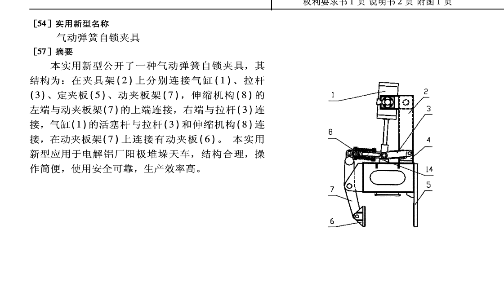
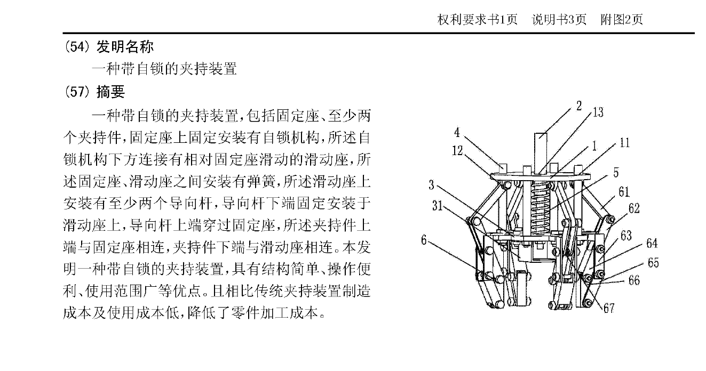
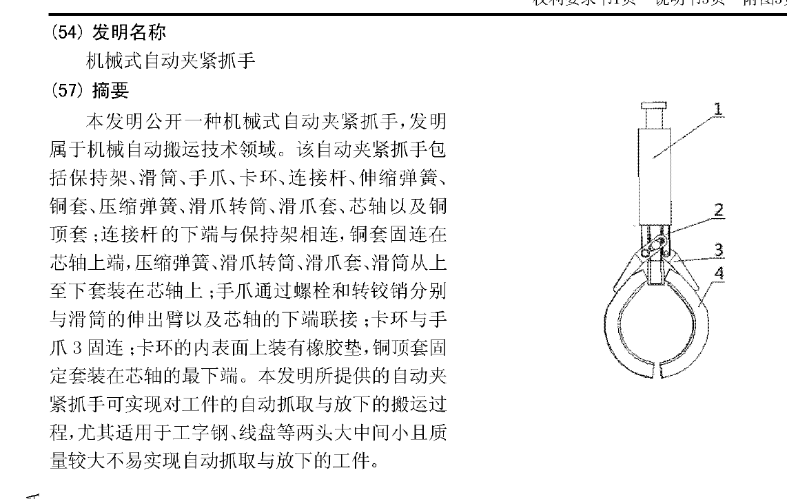

# RM2019 工作总结
> 陈晓满

## 一、	2018-2019赛季备赛期回顾  

### 二零一八年  

1. 九月，刚入校，加入RM“南工骁鹰”战队，作为预备队员进入机械组，与学长们一起参与工程机器人的研发。

2. 十月，参加队内机械组培训，初步接触了机械制图的基本常识、软件“solidworks 2016”的基础应用、三维实体图导出“.dwg”工程图。
 
3. 十一月， 加入于一鸣带领的小组进行抓取机构的研发和对气动应用的研究。作为大一新生，之前也从未接触过机器人，只能参与一些最简单的改图、导图的工作。
 
4. 十二月，逐渐完成了抓取机构的设计制作，发出了部分工程图进行加工。然而，工程组本定于圣诞节前完成的任务，却因为种种原因拖延。

### 二零一九年

5. 一月，23日是中期形态视频提交的日子，然而必做的步兵机器人还未达到要求。底盘悬挂软，行进过程中变形、抖动。在学期末的大会上，战队全员（除了宣传，学姐宣传做的真的好）受到了道川学长的批评，尤其是机械组。作为最底层的机械，其他组都要建立在良好、稳定的机械结构的基础上。我们没做好甚至没完成，电控、视觉没办法调试。  

    一月中旬，大一进行军训，只能在晚上结束训练后再去实验室熬夜干活。最后虽然中期形态视频完成，但大多机器人只有一个框架【步兵云台不稳定，没有视觉；英雄上坡超功率（PS：为了中期视频好看一点，尝试了多次，用了不同的两段视频拼接隐藏了英雄超功率的事实）；工程车未完成；哨兵未完成】，与同是第三年参赛的威海“HERO”战队相差甚远（步兵有完整的视觉、可以飞跃断桥；英雄有完整的视觉；工程有完整的功能；哨兵实现自瞄、自行运动）。    

    另外，工程机器人由于设计失误，原定的两套上岛方案：抱柱、月球车中，抱柱的机械爪无法工作，只得放弃；月球车方案孔位差错，上岛困难，需重做底盘。
 
6. 二月，开学后是更紧迫的备赛。完成一代工程车的组装后，邓嵛文重新设计工程车底盘，胡健乔改我们之前设计的取单机构。
 
7. 三月，由于学业繁忙，前哨兵总负责人离队，留下哨兵的烂摊子，我们几个大一的同学被分配去“拯救”哨兵，但由于能力不足，没有什么设计能力，只能四处抄图，将就拼出一个哨兵。

- 挑选操作手时，我报名了无人机的飞手。
 
8. 四月，无人机仅仅飞过一次，就因电池开关顺序问题（可能），烧掉了“guidance”和“N3”飞控系统，由于价格昂贵，暂时没有资金重新购买。错过即将开始的热身赛。

- 热身赛上，机器人各种各样的问题都暴露出来：步兵由于没有超级电容基本无法爬坡；工程由于高估滑轨的承重能力，导致取单机构伸出后导轨变形，高度无法控制；哨兵超重（其实哨兵那时候根本没有运动和射击能力，仅仅是一个空架子，热身赛前两天才完成哨兵的拼装，没有给电控和视觉留下太多的时间，到赛场上才发现yaw轴电机、拨弹轮电机和摩擦轮电机都出现了问题）。结果，虽然参加了热身赛，却没有测试到应该测试的功能。
 
- 结束热身赛，期中考试也开始了。但学长们还是挤出时间完成了工程车新取弹机构的设计和安装。

- 为了解决哨兵问题，队长、硬件组、英雄组来帮忙，因驱动方案意见不统一（英雄组认为侧驱好，硬件组认为做上驱动便于在原有基础上修改）且英雄组也需要完善英雄机器人的问题，方案暂定上驱动，当晚骏安学长与季源完成了哨兵底盘零部件的绘制（意味着整个哨兵没有一份完整的图纸），哨兵的云台采用无人机的云台（无人机暂时不能起飞，于是拆掉了无人机云台上的电机）。
 
9. 五月，所有机器人的机械部分基本完成。南部分区赛在即，留给电控和操作手的时间不多了。好在队长前期对电控的培训工作非常完美，电控和视觉基本在赛前完成了机器人的调试。  

- 同时，我们也终于重新购买了无人机的飞控和备用电池。  

- 13日晚，前往佛山，结束2018-2019赛季RM备赛期。

## 二、	RM2019南部分区赛

### 13日

晚上分批从深圳出发前往佛山。

### 14日

在赛场的备赛区，机器人还是有各种各样的小问题需要解决。  

预检录，无人机超尺寸（上方装吊环的碳管过长）。

### 15日

场地适应性训练，由于我操作的无人机飞行高度过低，被流弹击碎桨叶（现场情况并不清楚，裁判告诉我说是流弹所伤，但之前在实验室测试时17mm小弹击中桨叶只会被弹开，桨叶并不会碎），为保证安全，裁判让我就地降落，那时无人机的姿态非常不稳定，而且下方是断桥，无人机降落后作支撑腿的碳管断裂（当时为了省钱没有用加工件，而是在网上购买的现成的零件，装配误差很大，导致无人机的腿无法在槽中保持稳定。）。事后经检查，无人机的桨叶有三根被打断，最初设计时未考虑到此情况，没有准备多余的桨叶，只得当场联系商家紧急购买一批备用桨叶。

晚上的抽签，我们的运气很好，小组内其他队伍水平一般。。。

### 16日

第一个比赛日，小组赛第一场对阵南华大学。BO2第一场步兵、工程遥控器均出现信号不好的问题，3号步兵无法移动，工程延迟很大。哨兵也出了问题（设计问题导致重心不稳，调试时就从轨道上脱落），被直接罚下，根据规则，哨兵机器人未上场时，“比赛开始两分钟后，该方基地所有防御消除，基地的护盾打开。”比赛开始后不久，我方机器人在对方半区进攻，对方步兵机器人“绕路偷家”，未能及时回救，基地血量被打掉1340。无人机又是被流弹所伤？？导致桨叶断裂，且我在返回降落的时候过于急切，导致一条腿断裂。第二场，我无视断桨、断腿强行起飞，直接导致无人机装上保护网，不仅将保护架撞断，而且被直接罚下。好在其他操作手的表现出色，我们在缺少一辆步兵的情况下仍取得了胜利。根据比赛规则，小组赛平局各积一分。  

下午，南华大学对阵北部湾大学，南华大学2:0取胜，我们若想出线，学在明天的比赛中全胜，且对对方基地输出将近3000点伤害。

### 17日

正如解说所说，“要么背水一战，要么佛山火车站”。

可是现实是残酷的，第一场比赛，虽然赢了，但未能拿下对方哨兵，没有对对方基地造成伤害，大家都知道，我们被淘汰了。没有人说什么，只是默默入场调试机器人，准备下一场。第二场战术很成功，比赛结束时，对方基地的血量定格在520。我们以2:0的比分击败北部湾大学，无缘淘汰赛。

## 三、	失败原因

1. 进度拖拉 各个机器人的机械结构（除英雄外）都是一拖再拖，给电控带来了很大的麻烦，如果能有更长的时间来调试，就能提前发现更多的错误，而不是在赛场上。  

2. 能力不足 对于大一的同学，在设计方面确实有些欠缺，不说一些新奇的“鬼才设计”，最简单的合理的设计可能都很难做到。有时候只能帮忙做一些打杂的活。

3. 场地限制 虽然今年我们的场地有了很大的改善，不在是两个小玻璃房子了，但是该有的轨道、资源岛、大神符、补给站，都不太完善。

4. 经费问题 报销很慢，垫钱越积越多，导致一些同学不敢垫钱。一些东西将就着用，不舍得买更好的。

5.	习惯不好 用完东西随便丢，螺栓、扳手不知道丢了多少。。。

## 四、	技术储备

1. 抱柱自锁机械爪：虽然今年失败了，但总体思路应该是没问题的。  

  

  

  

2. 拨弹盘卡弹问题：是否可以在拨弹盘出弹口出加半个盖子。

3. 硬质拨弹轮换成毛刷

4. 摩擦轮电机换成GM3508

5. 输弹管用未来工厂的光敏树脂打印

6. 悬挂的弹簧选型要慎重！！！不能太软！

7. 摩擦轮、拨弹轮转速设置两档，近处摩擦轮慢速、拨弹轮高速（前提做好发射机构，保证不卡弹）

8. 无人机的支撑结构可参考直升机。若要做四条独立的腿，需保证碳纤管的粗细和与铝管的装配精度。不要过于相信碳纤的强度。

9. 气动要小心使用，需购买合格的气阀、气瓶、气管、气缸，避免意外事件

## 五、	新赛季展望

下个赛季将是南工骁鹰战队参赛的第四年了，希望能够打出哈深的风采。  

1. 步兵在暑期小学期做出小陀螺样本，等比赛规则公布后再做更改。 

2. 重视哨兵！！！从今年的比赛来看，我们就输在哨兵上。哨兵不求别的，底盘一定要稳。发弹虽然也很重要，但那是锦上添花，基础的运动一定要做好！

3. 无人机的研发需要图纸，今年的无人机没有图纸，结果就出现了很多细节上的小错误。而今年的强队无人机都很强，无人机由于它不限射频的特殊性，完全可以在短时间内造成巨大的伤害！

4. 工程取弹机构优于上岛。岛上的弹药箱一箱有20发大弹，但是若连下方的弹丸都取不好，上岛的用处体现不出来。另外，与英雄的对接需要仔细考虑。

## 六、	写在最后

这一年在战队里，收获很多。比赛结果不如人意，所有人都很难过。想到大三的学长学姐们最后一年参赛，我们却没能给他们留下一个完美的回忆，觉得很对不起他们。虽然我自认为我们今年有了进淘汰赛的实力，但运气也是实力的一部分。希望能在下一赛季更加努力，做到更好！

