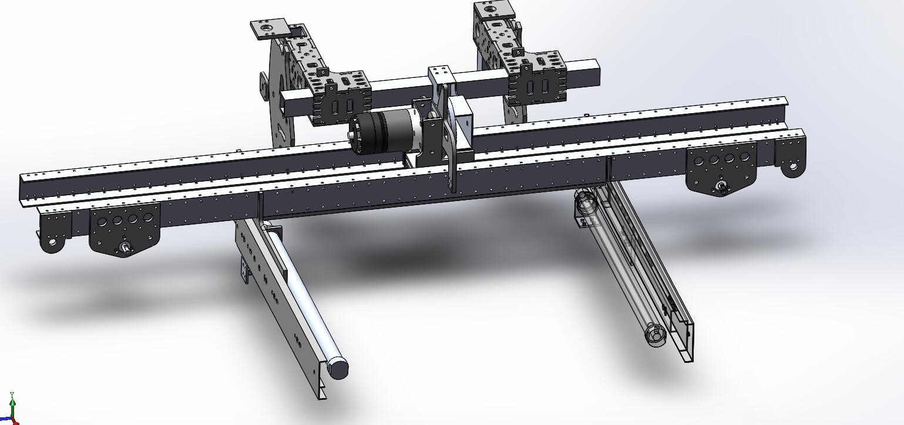
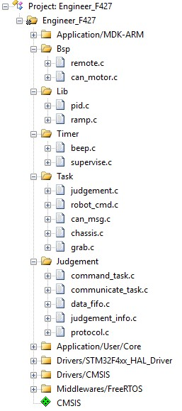
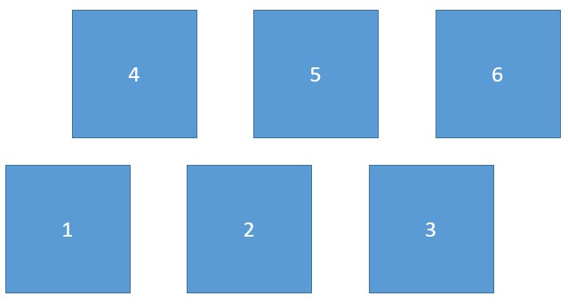

# 步兵机器人-电控技术文档
> 谢胜

## 一、功能综述
RM2019所用的工程机器人使用的是月球车式登岛，底盘装有六个电机。夹取机构使用了三个气缸，分别控制夹取机构的抬升、前伸和夹取动作，夹爪的翻转、平移使用了两个2006电机和一个3508电机。具体的机械设计结构参考机械设计模型或机器人实物。



工程机器人实现了大赛要求的所有基本功能，包括可全向移动的底盘、拖车救援、登岛和获取弹药箱。同时工程机器人还额外搭载了两个小型摄像头和显示屏，用于取弹补弹和救援时进行视角切换。
机器人内置停止模式，校准模式，手动模式，半自动模式和全自动模式共五种模式，可手动校准夹爪位置，支持遥控器和键盘同时使用，支持一键夹取操作。具体见机器人操作使用说明书一节。
使用了单独设计的监控模块，可时刻监控机器人的各个外设，并在外设丢失时及时作出反应，再次基础上有遥控器丢失保护措施。外设监控的数量没有上线，也可手动更改外设失联时间上限。
机器人使用了FreeRTOS操作系统，将任务切换和电机参数计算两者分割开，使代码更具可拓展性，可维护性更强。
 
## 二、代码结构

Bsp文件夹存储的是机器人外设的基本驱动库，包含遥控器驱动`remote.c`和无刷电机驱动`can_motor.c`。

Lib文件夹存储的是代码中频繁使用的函数库，包含用于PID计算的`pid.c`和斜坡函数`ramp.c`。但因后期工程机器人的底盘控制改为遥控器控制，所以并未使用到斜坡函数。

Timer文件夹存储的是FreeRTOS系统中的定时器文件，包括蜂鸣器`beep.c`和监控程序`supervise.c`。

Task文件夹存储的是FreeRTOS系统中的各个线程文件。包括裁判系统处理线程`judgement.c`，机器人模式切换线程`robot_cmd.c`，电机数据发送线程`can_msg.c`，底盘控制线程`chassis.c`和夹爪控制线程`grab.c`。
Judgement文件夹存储的是裁判系统数据处理需要的文件，其中裁判系统数据存储在`judgement_info.c`里面。

整份代码结构可分为三层：顶层、中间层和底层。顶层主要是`robot_cmd.c`文件，它负责机器人各个外设的工作模式切换，相当于操作手手里的遥控器，是最接近操作手的一层，因此为顶层。在`robot_cmd.h`中定义了各个外设的工作模式和机器人本身的工作模式。

中间层包括`chassis.c`、`grab.c`和`supervise.c`，前两者分别负责底盘和夹爪机构的控制。预先定义了好几种可能的工作模式，将根据顶层的模式切换进行相应的参数计算。supervise.c对各个外设进行监控，并将外设情况反馈给`chassis.c`和`grab.c`。

底层包括`judgement.c`，`can_msg.c`，`remote.c`，`can_motor.c`和`beep.c`，它们负责和底层打交道，负责外设数据的收发操作。

这种代码结构将用户逻辑和机器逻辑较为清晰地分开，如果操作手需要修改操作方式可只修改顶层代码，因为顶层代码只是把各个模块的各个工作模式进行组合。如果操作手需要修改某一个功能的具体实现或者想增添新的功能，则需要修改中间层的代码。

## 三、操作说明书
工程机器人一共有五种工作模式：停止模式、校准模式、手动模式、半自动模式、全自动模式，其中自动指的是取弹方式。
### 停止模式
**触发方式：**
遥控器右上角拨杆拨至最下面

**工作特点：**
此时机器人不工作，无法控制
### 校准模式
**触发方式：**
遥控器右上角拨杆拨至最上面

**工作特点：**
此时机器人所有电机无输出，操作手可手动调整电机位置。程序不断记录当前夹爪的三个电机的位置为初始位置。

可结合手动模式对夹爪机构进行快速校准。

**操作要点：**
该模式下，操作手应保证夹爪回归，并位于最左侧位置，离开校准模式时，程序锁定电机的初始位置。
### 手动模式
**触发方式：**
遥控器左上角拨杆拨至最下面，右上角拨杆拨至中间位置

**工作特点：**
* 该模式下可使用遥控器控制机器人夹爪的所有无刷电机和气缸状态。
* 可使用键盘控制六个舵机的位置。
* 不可控制屏幕的信号源切换以及屏幕的电源开关。
* 不可控制底盘电机的运动（此时底盘锁住）。
* 该模式常用于机械调试，检录以及夹爪校准。

**操作要点：**
遥控器右侧拨杆：
* 左右：控制夹爪的左右移动（只控制夹爪的移动速度）
* 上下：控制机器人的抬升气缸

遥控器左侧拨杆：
* 左右：控制夹爪的张开夹紧
* 前后：控制夹爪的前后气缸

遥控器左上小拨轮：
* 控制夹爪的前、后翻

键盘：
* Q：弹仓门舵机
* W：图传舵机
* E：拖车舵机
### 半自动模式
**触发方式：**
遥控器左上角拨杆拨至中间，右上角拨杆拨至中间位置

**工作特点：**
* 该模式下可使用遥控器控制底盘运动
* 可使用键盘控制六个舵机的位置
* 可控制夹爪单独夹取某一个位置的弹药箱
* 不可控制屏幕的信号源切换以及屏幕的电源开关
* 不可控制升降气缸的状态

**操作要点：**
遥控器右侧拨杆：
* 左右：控制底盘左右平移
* 前后：控制底盘前后平移

遥控器左侧拨杆：
* 左右：控制底盘左右旋转

键盘：
* Q：弹仓门舵机
* W：图传舵机
* E：拖车舵机
* A：取第二排左边弹药箱
* S：取第二排中间弹药箱
* D：取第二排右边弹药箱
* Z：取第一排左边弹药箱
* X：取第一排中间弹药箱
* C：取第一排右边弹药箱

**注意事项：**
进入该模式之前，请确保夹爪电机已正确校准。

该模式下的夹爪默认位置是正对第一排中间弹药箱的中线位置。
### 全自动模式
**触发方式：**
遥控器左上角拨杆拨至最上面，右上角拨杆拨至中间位置

**工作特点：**
* 该模式下可使用遥控器控制底盘运动
* 可使用键盘控制六个舵机的位置
* 可控制夹爪一次性夹取一排弹药箱
* 可控制夹爪单独夹取正前方弹药箱
* 可控制屏幕的信号源切换以及屏幕的电源开关
* 可控制升降气缸的状态

**操作要点：**
遥控器右侧拨杆：
* 左右：控制底盘左右平移
* 前后：控制底盘前后平移

遥控器左侧拨杆：
* 左右：控制底盘左右旋转

键盘：
* Q：弹仓门舵机
* W：图传舵机
* E：拖车舵机
* A：切换屏幕信号源
* S：开/关屏幕
* D：控制升降气阀
* Z：取第一排弹药箱
* X：取第二排弹药箱

**注意事项：**
进入该模式之前，请确保夹爪电机已正确校准。

该模式下的夹爪默认位置是正对第一排中间弹药箱的中线位置。

取弹时只需要对准一次，也就是对准第一排中间弹药箱即可。 
## 四、外设初始化

### RCC


### SYS


### GPIO
设置指定的GPIO口为推挽输出模式。主要用于点亮LED灯或点亮激光。此外使用软件IIC也需要使能GPIO为输出模式（也可使能输入模式）。


### CAN
CAN1和CAN2都使能，要注意使能的引脚与硬件原理图中的硬件是否相同。设置预分频为3，BS1为9，BS2为4，SJW为1（这种设置方式建立在时钟频率为168MHz的基础上），使能RX0中断


### USART
唯一要注意的是遥控器接收机对应的串口，需要硬件上有一个取反电路，否则读取到的数据不对。遥控器的串口波特率设置为100000bps，偶校验，8位，建议使能DMA。
![USART波特率设置]{USART1.jpg}


### FreeRTOS
如果要使用虚拟定时器，需要在Config parameters里面手动使能定时器

其中TIMER_TASK_PRIORITY建议设置为3（对应于线程的优先级为osPriorityNormal），若优先级太低可能会被其他线程饿死。
 
## 五、外设驱动
### 电机驱动
* [步兵车底盘驱动](https://imuncle.github.io/content.html?id=3)
* [英雄车云台PID调试总结](https://imuncle.github.io/content.html?id=13)

### 遥控器驱动
* [步兵车底盘驱动](https://imuncle.github.io/content.html?id=3)
* [串口空闲中断接收遥控器数据](https://imuncle.github.io/content.html?id=50)
### 裁判系统数据读取
[裁判系统数据读取探索](https://imuncle.github.io/content.html?id=8)
### 气动电磁阀驱动
工程机器人使用的气动用到了可控制气流通断的电磁阀。电磁阀24V驱动，一共两个状态，不通电一个状态，通电另一个状态，且无正负极之分。电磁阀电流较小，直接使用了二代官方板上的四个可控24V输出口。
### 蜂鸣器驱动
蜂鸣器采用PWM驱动，代码中的PWM预分频后时钟频率为1MHz，PWM占空比保持为50%，即CCR一直未ARR的一半，这样发出的信号为方波，通过改变ARR的值改变PWM的周期，来改变蜂鸣器的音调高低。

蜂鸣器的周期定义如下：
```c
#define L_Do 3822
#define L_Re 3405
#define L_Mi 3033
#define L_Fa 2863
#define L_So 2551
#define L_La 2272
#define L_Xi 2024
#define M_Do 1911
#define M_Re 1702
#define M_Mi 1526
#define M_Fa 1431
#define M_So 1275
#define M_La 1136
#define M_Xi 1012
#define H_Do  955
#define H_Re  851
#define H_Mi  758
#define H_Fa  715
#define H_So  637
#define H_La  568
#define H_Xi  506
```
比如M_Do，周期为1911，单位μs，可以很容易计算出此时的PWM频率为523.29Hz，这正是c3#音阶对应的频率。其他音阶也可用相同的方法计算出。
 
## 六、线程详解
### 1、机器人指令线程
`robot_cmd.c`中cmd代表的就是command，该线程属于顶层结构，如同遥控器一样，负责处理操作手的操作信息，并对各个模块的工作状态进行切换。

该线程里包括了机器人状态切换、底盘状态切换和夹爪状态切换三部分。
机器人的各个状态定义如下：
```c
enum WorkState_e
{
    STOP,
    NORMAL
};

struct Chassis_t
{
    int FBSpeed;
    int LRSpeed;
    int RotateSpeed;
    enum
    {
        Normal,
        Lock,
        ChassisDie
    } workstate;
};

struct Grab_t       //存储各个气缸的状态，0为初始状态；储存取弹任务
{
    char lift_cylinder:1;
    char forward_cylinder:1;
    char grab_cylinder:1;
    char grab_flag;
    char grab_task[6];
    char task_id;
    enum grab_state_t
    {
        STOP_GRAB,
        GRAB_RESET,
        HORIZON_MOVE_1,//第一次水平移动
        GRAB_OUT_1,//夹爪前翻
        GRAB_CLAMP,//夹爪夹紧
        GRAB_IN_1,//夹爪后翻
        HORIZON_MOVE_2,//第二次水平移动
        HORIZON_MOVE_3,
        GRAB_RELEASE,
        HORIZON_MOVE_4,
        AUTO_GRAB_1,
        AUTO_GRAB_2
    } workstate;
};

struct Robot_t
{
    enum WorkState_e workstate;
    struct Chassis_t chassis;
    struct Grab_t grab;
};
```
从上面的代码中可以看出，机器人的所有重要数据都存储在结构体Robot_t中。

机器人工作状态有STOP和NORMAL两种，主要根据遥控器的输入情况进行切换。

底盘工作状态有Normal、Lock和ChassisDie三种，分别代表正常模式（可被遥控）、锁死（速度环锁死）和死亡（无输出）。根据机器人工作状态和遥控器的输入情况进行切换。

夹爪工作状态很多，可以分为停止状态（STOP_GRAB）、初始状态（GRAB_RESET）和夹取状态（剩余的状态）。根据遥控器输入情况进行切换。

具体实现代码如下：
```c
void RobotStateChange(void)
{
    if(Is_Serious_Error() || Remote.inputmode == RC_Stop || Remote.rc.s2 == 0)
    {
        robot.workstate = STOP;
    }
    else
    {
        robot.workstate = NORMAL;
    }
}

void ChassisStateChange(void)
{
    if(robot.workstate == STOP || Remote.rc.s1 == 2)
    {
        robot.chassis.workstate = ChassisDie;
    }
    else
    {
        robot.chassis.workstate = Normal;
    }
}

void GrabStateChange(void)
{
  if(Remote.rc.s1 == 1)     //全、半自动模式
    {
        if(Remote.key_time.d%2 == 1)
            robot.grab.lift_cylinder = 1;
        else
            robot.grab.lift_cylinder = 0;
    }
    else if(Remote.rc.s1 == 2)      //不自动模式
    {
        left_motor.speed_pid.ref = -(Remote.rc.ch0 - 1024)*5;
        right_motor.speed_pid.ref = -(Remote.rc.ch0 - 1024)*5;
        
        if(Remote.rc.ch1 > 1350 && Remote.last_rc.ch1 < 1350)
        {
            robot.grab.lift_cylinder = 1;
            Remote.key_time.d = 1;
        }
        if(Remote.rc.ch1 < 500 && Remote.last_rc.ch1 > 500)
        {
            robot.grab.lift_cylinder = 0;
            Remote.key_time.d = 0;
        }
        
        if(Remote.rc.ch3 > 1350 && Remote.last_rc.ch3 < 1350)
            robot.grab.forward_cylinder = 1;
        if(Remote.rc.ch3 < 500 && Remote.last_rc.ch3 > 500)
            robot.grab.forward_cylinder = 0;
        
        if(Remote.rc.ch2 > 1350 && Remote.last_rc.ch2 < 1350)
            robot.grab.grab_cylinder = 1;
        if(Remote.rc.ch2 < 500 && Remote.last_rc.ch2 > 500)
            robot.grab.grab_cylinder = 0;
        
        if(Remote.rc.ch4 > 1350 && Remote.last_rc.ch4 < 1350)
            robot.grab.grab_flag = 1;
        if(Remote.rc.ch4 < 500 && Remote.last_rc.ch4 > 500)
            robot.grab.grab_flag = 0;
        
        //DEBUGGING
        if(Remote.key.z == 1 && Remote.key.x == 1 && Remote.key.c == 1)
        {           
            __set_FAULTMASK(1);   //STM32程序软件复位  
             NVIC_SystemReset(); 
        }
    }
}
```
上述代码可结合操作说明一节进行理解。其中GrabStateChange()函数中还实现了手动模式下的夹爪控制逻辑。
### 2、底盘线程
底盘就太简单了，这里与步兵机器人的区别只是多了两个轮子，而这两个轮子只有前后和转弯的时候转动，转动规律与各自同列的轮子是相同的，左右横移时轮子是不转的。工程机器人也没有功率限制，所以六个轮子的速度分解如下：
```c
  m3508_1.speed_pid.ref = robot.chassis.FBSpeed + robot.chassis.LRSpeed + robot.chassis.RotateSpeed;
  m3508_2.speed_pid.ref = -robot.chassis.FBSpeed + robot.chassis.LRSpeed + robot.chassis.RotateSpeed;
  m3508_3.speed_pid.ref = robot.chassis.FBSpeed - robot.chassis.LRSpeed + robot.chassis.RotateSpeed;
  m3508_4.speed_pid.ref = -robot.chassis.FBSpeed - robot.chassis.LRSpeed + robot.chassis.RotateSpeed;
  m3508_5.speed_pid.ref = robot.chassis.FBSpeed + robot.chassis.RotateSpeed;
  m3508_6.speed_pid.ref = -robot.chassis.FBSpeed + robot.chassis.RotateSpeed;
```
其余部分可参考步兵车底盘驱动。

### 3、夹爪线程
该线程（grab.c）是整个工程机器人代码中最复杂的一部分。该部分控制了整个夹爪机构（包括三个电机和三个气阀），六个舵机和一个屏幕。

其中六个舵机分为三对，分别控制弹仓开合、拖车机构伸缩和图传俯仰。屏幕经过硬件组改装后可通过GPIO的开漏输出（推挽输出无效）控制屏幕的图像源（即切换摄像头）和屏幕的开关。这些都较为简单，在此不做进一步的讲解。此处详细讲解夹爪机构的控制逻辑。

夹爪机构一共有三种工作模式：手动模式、半自动模式和全自动模式。其中手动模式较为简单（详见机器人指令线程），剩下的半自动模式和全自动模式均基于同一套任务执行系统。

半自动模式和全自动模式采用的是一种任务预约的方式，在robot_cmd.h中定义有一个长度为6的数组，即最多可以预约六个抓取任务。相关函数在remote.c里面：
```c
/* 添加任务函数。任务存储在一个长度为3的数组中 */
void AddGrabTask(char id)
{
    if(robot.grab.task_id == 6)
    {
        robot.grab.task_id = 0;
    }
    if(robot.grab.grab_task[robot.grab.task_id] == 0)
    {
        robot.grab.grab_task[robot.grab.task_id] = id;
        robot.grab.task_id ++;
    }
}
```
任务id一共有9种，这里结合弹药箱的位置解释一下：



在资源岛两侧有六个弹药箱，任务id的1-6号对应的就是单独取对应编号的弹药箱，即半自动模式。7号任务对应的是一次性取1/2/3三个弹药箱，8号任务对应的是一次性取4/5/6三个弹药箱，即全自动模式。9号任务单独用于取资源岛上的弹药箱（位置正对2号弹药箱，但位于第二排的位置）。

因为涉及到路径最短的优化问题，所以理论上全自动模式可以用三个半自动模式代替，但还是单独使用了一个任务id，并且单独设置了一种夹爪工作模式，且单独写了一个全自动抓取函数（其实就是把三个半自动组合起来）。这里就不详细讲解全自动的函数了，我将它的抓取工作分为了21步，较为繁琐，在理解了半自动的工作方式后可自己看代码理解。

那么就以抓取1号弹药箱为例进行讲解，所有逻辑都在ProcessGrab()函数中。

这里我设置了一个夹爪是否在工作的标志位grab_process_flag，1代表正在执行夹取任务。如果没有执行任务，则一直扫描任务数组：
```c
if(grab_process_flag == 0)
{
    if(grab_task_count == 6)
        grab_task_count = 0;
    CheckGrabTask(robot.grab.grab_task[grab_task_count]);
    grab_task_count++;
}
假设现在有一个任务1预约，那么执行到CheckGrabTask()函数：
/* 检测是哪个任务，并设置相应的任务执行时间 */
void CheckGrabTask(char task_id)
{
    if(task_id == 0)
    {
        grab_process_flag = 0;
        robot.grab.workstate = GRAB_RESET;
    }
    else
    {
        switch(task_id)
        {
            case 1:
                left_motor_tmp_position = left_init_position + grab_motor_position[0];
                right_motor_tmp_position = right_init_position + grab_motor_position[0];
                left_motor_middle_position = left_init_position + grab_motor_position[5];
                right_motor_middle_position = right_init_position + grab_motor_position[5];
                robot.grab.forward_cylinder = 0;
                break;
            case 2:
                left_motor_tmp_position = left_init_position + grab_motor_position[1];
                right_motor_tmp_position = right_init_position + grab_motor_position[1];
                left_motor_middle_position = left_init_position + grab_motor_position[5];
                right_motor_middle_position = right_init_position + grab_motor_position[5];
                robot.grab.forward_cylinder = 0;
                break;
            case 3:
                left_motor_tmp_position = left_init_position + grab_motor_position[2];
                right_motor_tmp_position = right_init_position + grab_motor_position[2];
                left_motor_middle_position = left_init_position + grab_motor_position[5];
                right_motor_middle_position = right_init_position + grab_motor_position[5];
                robot.grab.forward_cylinder = 0;
                break;
            case 4:
                left_motor_tmp_position = left_init_position + grab_motor_position[3];
                right_motor_tmp_position = right_init_position + grab_motor_position[3];
                left_motor_middle_position = left_init_position + grab_motor_position[5];
                right_motor_middle_position = right_init_position + grab_motor_position[5];
                robot.grab.forward_cylinder = 1;
                break;
            case 5:
                left_motor_tmp_position = left_init_position + grab_motor_position[4];
                right_motor_tmp_position = right_init_position + grab_motor_position[4];
                left_motor_middle_position = left_init_position + grab_motor_position[5];
                right_motor_middle_position = right_init_position + grab_motor_position[5];
                robot.grab.forward_cylinder = 1;
                break;
            case 6:
                left_motor_tmp_position = left_init_position + grab_motor_position[5];
                right_motor_tmp_position = right_init_position + grab_motor_position[5];
                left_motor_middle_position = left_init_position + grab_motor_position[5];
                right_motor_middle_position = right_init_position + grab_motor_position[5];
                robot.grab.forward_cylinder = 1;
                break;
            case 7:
                robot.grab.workstate = AUTO_GRAB_1;
                robot.grab.forward_cylinder = 0;
                break;
            case 8:
                robot.grab.workstate = AUTO_GRAB_2;
                robot.grab.forward_cylinder = 1;
                break;
            case 9:
                left_motor_tmp_position = left_init_position + grab_motor_position[1];
                right_motor_tmp_position = right_init_position + grab_motor_position[1];
                left_motor_middle_position = left_init_position + grab_motor_position[5];
                right_motor_middle_position = right_init_position + grab_motor_position[5];
                robot.grab.forward_cylinder = 1;
                break;
            default:
                left_motor_tmp_position = left_motor_reset_position;
                right_motor_tmp_position = right_motor_reset_position;
                robot.grab.forward_cylinder = 0;
        }
        grab_process_flag = 1;
        if(task_id != 7 && task_id != 8)
            robot.grab.workstate = HORIZON_MOVE_1;
    }
}
```
该函数的主要功能是根据任务id更改左右移动电机的位置环设定值。这里涉及到一个数组grab_motor_position[]，该数组定义如下：
```c
int grab_motor_position[6]={0,-842606,-1685211,-421303,-1263909,-2035494};
```
从左到右分别对应了1-6号弹药箱的电机位置增量。1号弹药箱在最左侧，所以以它为原点。这些数字是如何计算出来的呢？工程机器人夹爪移动依靠同步带实现，使用的同步轮为35齿，同步带齿距为3mm，所以移动1mm所对应的编码器变量为：

$$1/(35×3)×36×8192=2808.686$$
相邻两个弹药箱之间间距为300mm，对应的编码器增量为
$$2808.686×300=842605.8≈842606$$
数组的其他数字也可以按照相同的方式计算出来。

接下来就是夹取任务的具体实现。整个夹取任务分为8步：

#### 第一步：水平移动到弹药箱的位置
```c
case HORIZON_MOVE_1:
    left_motor.position_pid.ref = left_motor_tmp_position;
    right_motor.position_pid.ref = right_motor_tmp_position;
    if((left_motor.position_pid.ref - left_motor.position_pid.fdb > -800 && left_motor.position_pid.ref - left_motor.position_pid.fdb < 800)
    || (right_motor.position_pid.ref - right_motor.position_pid.fdb > -800 && right_motor.position_pid.ref - right_motor.position_pid.fdb < 800))
    {
        robot.grab.workstate = GRAB_OUT_1;
    }
    break;
```
当电机转动到指定位置附近时，进入下一个步骤。

#### 第二步：夹爪向前翻转
```c
case GRAB_OUT_1:
    robot.grab.grab_flag = 1;
    GrabMotorChange();
    if(grab_motor.position_pid.ref - grab_motor.position_pid.fdb > -1500 && grab_motor.position_pid.ref - grab_motor.position_pid.fdb < 1500)
    {
        robot.grab.workstate = GRAB_CLAMP;
        motor_stuck_count = 0;
    }
    else if(grab_motor.fdbSpeed <= 50)
    {
        motor_stuck_count ++;
    }
    break;
```
当夹爪电机转动到指定位置附近时，进入下一个步骤。

#### 第三步：夹取弹药箱
```c
case GRAB_CLAMP:
    robot.grab.grab_cylinder = 1;
    grab_count++;
    if(grab_count == 300)
    {
        grab_count = 0;
        robot.grab.workstate = GRAB_IN_1;
    }
    break;
```
这里留给气缸收缩夹紧的时间为300ms，延时到了之后进入下一个步骤。

#### 第四步：夹爪向后翻转收回
```c
case GRAB_IN_1:
    robot.grab.grab_flag = 2;
    GrabMotorChange();
    if(grab_motor.position_pid.ref - grab_motor.position_pid.fdb > -1500 && grab_motor.position_pid.ref - grab_motor.position_pid.fdb < 1500)
    {
        robot.grab.workstate = HORIZON_MOVE_2;
        motor_stuck_count = 0;
    }
    else if(grab_motor.fdbSpeed <= 50)
    {
        motor_stuck_count ++;
    }
    break;
```
这里的夹爪电机的位置环设定值是刚好把弹药箱拉出弹药箱槽时对应的位置（即要把弹药箱完全拉出来后才能水平移动），当电机转动到指定位置附近时，进入下一个步骤。

### 第五步：水平移动至2号弹药箱位置
在该位置可以将大弹丸收集到弹仓中，同时夹爪电机继续回转收回。
```c
case HORIZON_MOVE_2:
    left_motor.position_pid.ref = left_motor_reset_position;
    right_motor.position_pid.ref = right_motor_reset_position;
    robot.grab.grab_flag = 0;
    GrabMotorChange();
    if((left_motor.position_pid.ref - left_motor.position_pid.fdb > -800 && left_motor.position_pid.ref - left_motor.position_pid.fdb < 800)
    || (right_motor.position_pid.ref - right_motor.position_pid.fdb > -800 && right_motor.position_pid.ref - right_motor.position_pid.fdb < 800))
    {
        if(grab_motor.position_pid.ref - grab_motor.position_pid.fdb > -1500 && grab_motor.position_pid.ref - grab_motor.position_pid.fdb < 1500)
        {
            grab_count++;
            if(grab_count == 300)
            {
                robot.grab.workstate = HORIZON_MOVE_3;
                grab_count = 0;
            }
            motor_stuck_count = 0;
        }
        else if(grab_motor.fdbSpeed <= 50)
        {
            motor_stuck_count++;
        }
    }
    break;
```
当三个电机都转动到指定位置附近时，进入下一个步骤。

#### 第六步：水平移动至3号弹药箱位置
避免弹药箱掉落在立柱禁区
```c
case HORIZON_MOVE_3:
    left_motor.position_pid.ref = left_motor_middle_position;
    right_motor.position_pid.ref = right_motor_middle_position;
    if((left_motor.position_pid.ref - left_motor.position_pid.fdb > -800 && left_motor.position_pid.ref - left_motor.position_pid.fdb < 800)
    || (right_motor.position_pid.ref - right_motor.position_pid.fdb > -800 && right_motor.position_pid.ref - right_motor.position_pid.fdb < 800))
    {
        robot.grab.workstate = GRAB_RELEASE;
    }
    break;
```
当电机转动到指定位置附近时，进入下一个步骤。

#### 第七步：松开夹爪，扔掉弹药箱。
```c
case GRAB_RELEASE:
    robot.grab.grab_cylinder = 0;
    grab_count++;
    if(grab_count == 300)
    {
        robot.grab.workstate = HORIZON_MOVE_4;
        grab_count = 0;
    }
    break;
```
这里留给气缸张开的时间为300ms，延时到了之后进入下一个步骤。

#### 第八步：回到初始位置（2号弹药箱位置），结束抓取任务
```c
case HORIZON_MOVE_4:
    left_motor.position_pid.ref = left_motor_reset_position;
    right_motor.position_pid.ref = right_motor_reset_position;
    if((left_motor.position_pid.ref - left_motor.position_pid.fdb > -800 && left_motor.position_pid.ref - left_motor.position_pid.fdb < 800)
    || (right_motor.position_pid.ref - right_motor.position_pid.fdb > -800 && right_motor.position_pid.ref - right_motor.position_pid.fdb < 800))
    {
        robot.grab.grab_task[grab_task_count-1] = 0;
        grab_process_flag = 0;
        if(robot.grab.grab_task[grab_task_count] == 0)
        {
            robot.grab.forward_cylinder = 0;
        }
        robot.grab.workstate = GRAB_RESET;
    }
    break;
```
当电机转动到指定位置附近时，结束本次取弹任务，grab_process_flag清零，对应的任务数组位清零。

### 4、监控线程
监控线程是处理机器人意外情况的强硬手段。核心函数如下：
```c
int lost_err =  0x0000;                   //外设监控错误标志。该变量共12位，每一位可作为一个外设是否丢失的标志位，一共可检测12个外设。0代表未丢失，1代表丢失
int lost_counter[DETECT_NUM] = {0};       //各个外设对应的递增计数器，如果向上溢出则说明

/**
* @brief 机器人各个外设的监控函数
* @param None
* @retval None
*/
void Supervise()
{
    for(int i = 0; i < DETECT_NUM; i++)     //依次扫描各个外设的递增计数器是否溢出
    {
        if(lost_counter[i] < 40)              //如果没有溢出则继续计数，并将丢失标志位置0
        {
            lost_counter[i]++;
            lost_err &= ~(1<<i);
        }else{                                //如果计数向上溢出，将丢失标志位置1
            lost_err |= (1<<i);
        }
    }
}
```
监控函数本质就是为每一个外设构造了一个看门狗。每个外设有一个计数，该计数默认以500Hz的频率进行累加，每次外设反馈数据回来清零一次计数，如果计数大于某个阈值就认为该外设丢失。

监控函数使用一个16位的数字，为每一个外设单独设置标志位（支持上限16个外设，如果有更多的外设则需要更改标志位的数据类型）。
```c
/**
* @brief 重载机器人各个外设的递增计数器（喂狗）
* @param None
* @retval None
*/
void LostCounterFeed(int index)
{
    lost_counter[index] = 0;
}

/**
* @brief 判断机器人指定外设是否丢失
* @param 外设编号
* @retval 外设是否丢失：0代表未丢失，非0代表丢失
*/
int Is_Error(int index)
{
    return (index&lost_err);
}
```
