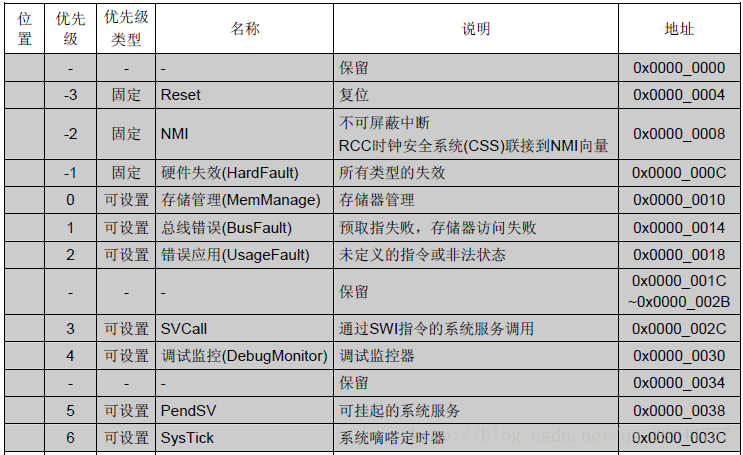
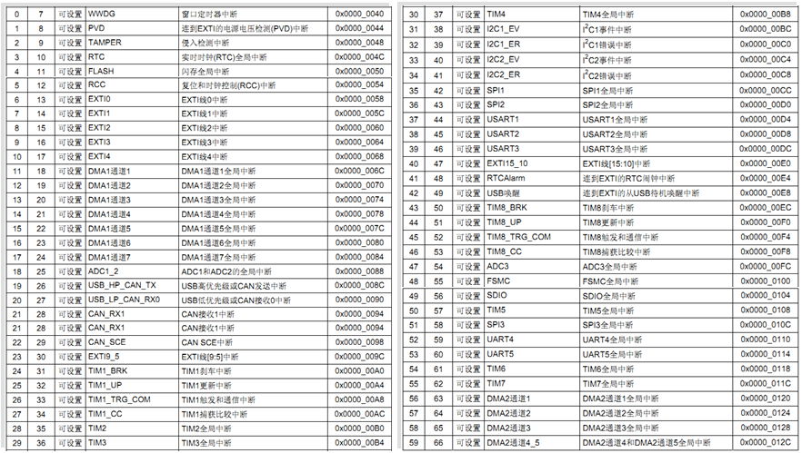
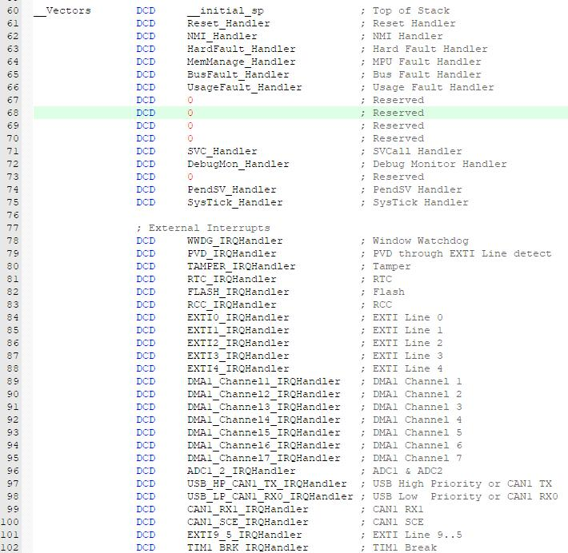
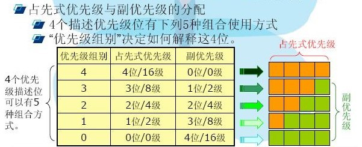
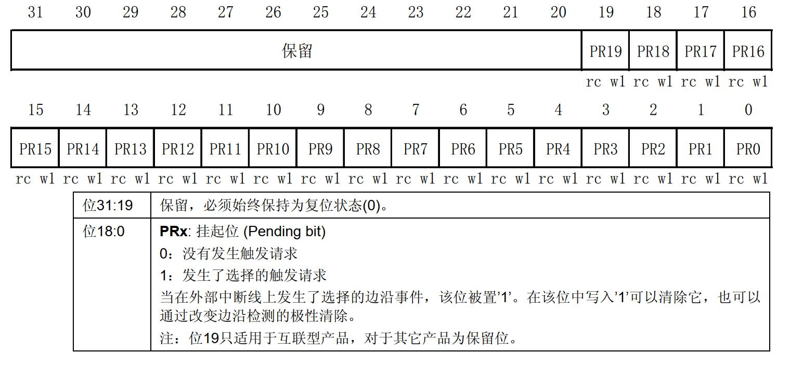
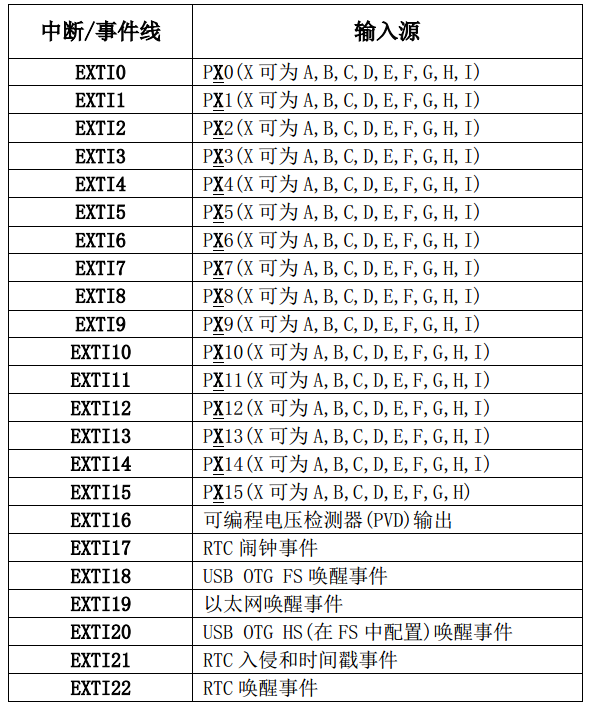
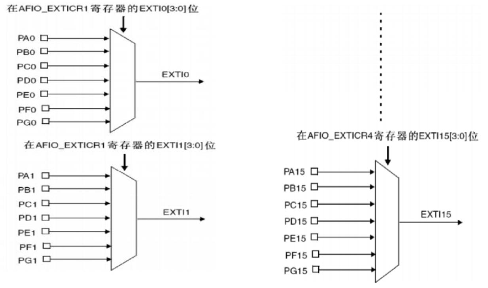
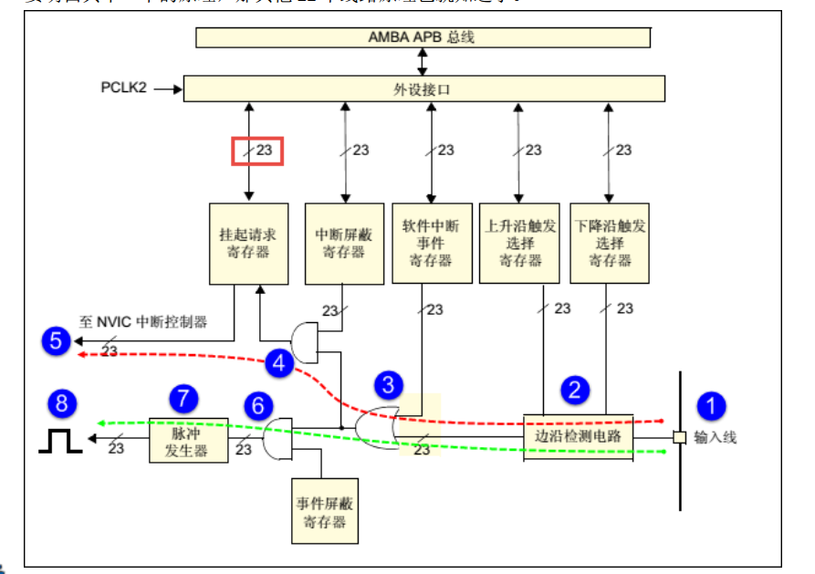

# 基本信息
* 课程名称：外部中断 - EXTI
* 讲师：谢胜
* 培训时间：2019/9/19 19:00-22:00
* 培训地点：T3 706
* 培训人数：15人

# 教学要点
1. 认识中断
2. 了解中断分类，中断优先级
3. 认识中断函数，中断回调函数
4. 认识GPIO外部中断（分类，分组）

# 教学重点
1. 中断优先级配置，中断分组
2. EXTI使用

# 教学难点
1. EXTI分组，分类，使用

# 教学准备
1. 学生准备：电脑、单片机、下载器
2. 教师准备：借教室

# 教学过程
## 第一步：系统中断介绍
### 中断简介
`中断`是指计算机运行过程中，出现某些**意外情况**需主机干预时，机器能自动停止正在运行的程序并转入处理新情况的程序，处理完毕后又返回原被暂停的程序继续运行。

众所周知，处理器的速度跟外围硬件设备的速度往往不在一个数量级上，因此，如果内核采取让处理器向硬件发出一个请求，然后专门等待回应的办法，显然降低内核效率。

既然硬件的响应这么慢，那么内核就应该在此期间处理其他事务，等到硬件真正完成了请求的操作之后，再回过头来对它进行处理。想要实现这种功能，轮询（polling）可能会是一种解决办法。可以让内核定期对设备的状态进行查询，然后做出相应的处理。不过这种方法很可能会让那个内核做不少无用功，因为无论硬件设备是正在忙碌着完成任务还是已经大功告成，轮询总会周期性的重复执行。更好的办法是由我们来提供一种机制，让硬件在需要的时候再向内核发出信号（变内核主动为硬件主动），这就是中断机制。

中断是实现多道程序设计的必要条件。

### NVIC
能够打断当前代码执行流程的事件分为异常(exception)和中断(interrupt)，他们都被编排在中断向量表里面。





同样的以上中断向量还可以在STM32的启动文件（比如F103系列的启动文件`startup_stm32f103xe.s`）中找到：



编号为负的内核异常不能被设置优先级，如复位(Reset)、不可屏蔽中断 (NMI)、硬错误(Hardfault)。从编号 7 开始的为外部中断，这些中断的优先级都是可以自行设置的。

STM32的中断服务依靠`嵌套向量中断控制器`NVIC（Nested Vectored Interrupt Controller）实现。NVIC的核心功能是中断优先级分组、中断优先级的配置、读中断请求标志、清除中断请求标志、使能中断、清除中断等。外部中断信号从核外发出，信号最终要传递到NVIC(嵌套向量中断控制器)。NVIC跟内核紧密耦合，它控制着整个芯片中断的相关功能。

### 中断优先级分组
STM32 的中断向量具有两个属性，一个为抢占属性，另一个为响应属性，其属性编号越小，表明它的优先级别越高。

抢占，是指打断其它中断的属性，即因为具有这个属性，会出现嵌套中断(在执行中断服务函数 A 的过程中被中断 B 打断，执行完中断服务函数 B 再继续执行中断服务函数 A)。

而响应属性则应用在抢占属性相同的情况下，当两个中断向量的抢占优先级相同时，如果两个中断同时到达，则先处理响应优先级高的中断。

在STM32中，抢占优先级和响应优先级的数量由一个 4 位的数字来决定，把这个 4 位数字的位数分配成抢占优先级部分和响应优先级部分。



## 第二步：中断函数的实现
要产生中断，必须先配置好并使能中断线。根据需要的边沿检测设置2个触发寄存器，同时在中断屏蔽寄存器的相应位写’1’允许中断请求。当外部中断线上发生了期待的边沿时，将产生一个中断请求，对应的挂起位也随之被置’1’。在挂起寄存器的对应位写’1’，将清除该中断请求。

如果需要产生事件，必须先配置好并使能事件线。根据需要的边沿检测通过设置2个触发寄存器，同时在事件屏蔽寄存器的相应位写’1’允许事件请求。当事件线上发生了需要的边沿时，将产生一个事件请求脉冲，对应的挂起位不被置’1’。

通过在软件中断/事件寄存器写’1’，也可以通过软件产生中断/事件请求。

1. 一般来说单片机的中断发生有两个条件，一是中断标志位置位，二是中断允许，如果这两个条件都满足则进入中断，因为正常情况下中断一直是允许的，那么只能通过标志位来区分是否有中断挂起，
2. 如果进入中断不清除标志位，那么这一中断服务程序结束后由于标志位还是置位的并且中断是允许的，那么还会再次进入该中断，就会发生一直在执行中断程序的情况
3. 周期性中断是由定时器辅助完成的，只要定时时间到，硬件就会自动置位标志位，这时中断发生，定时器还在运行，与中断处理是并行的没有冲突，因此周期性的中断不是从中断标志位清零开始的。
4. 如果中断程序没有执行完并且一下个中断又来了，那么硬件还是会自动置位标志位的，如果在这之前已经清零标志位那么中断结束后会再进入一次该中断，如果这时还没有清除中断标志位，则第二个1毫秒中断无效。



## 第三步：EXTI介绍


STM32 一共有 16 组外部中断， 其与各个 GPIO 的区别如下图所示：



EXTI有两大模式：中断模式和事件模式。中断模式产生中断，事件模式产生事件。

产生中断的目的是把输入信号输入到NVIC中，进一步执行中断服务函数，实现功能，这是软件级别的。而产生事件的目的是传输一个脉冲信号给其他外设使用，并且这是电路级别的信号传输，属于硬件级别的，比如可以给定时器TIMER或者ADC等使用。



每一种模式都可配置为上升沿触发、下降沿触发，以及上升下降沿触发三种触发方式。

## 第四步：EXTI中断回调函数
```c
/**
  * @brief This function handles EXTI line0 interrupt.
  */
void EXTI0_IRQHandler(void)
{
  /* USER CODE BEGIN EXTI0_IRQn 0 */

  /* USER CODE END EXTI0_IRQn 0 */
  HAL_GPIO_EXTI_IRQHandler(GPIO_PIN_0);
  /* USER CODE BEGIN EXTI0_IRQn 1 */

  /* USER CODE END EXTI0_IRQn 1 */
}
```

```c
/**
  * @brief  This function handles EXTI interrupt request.
  * @param  GPIO_Pin: Specifies the pins connected EXTI line
  * @retval None
  */
void HAL_GPIO_EXTI_IRQHandler(uint16_t GPIO_Pin)
{
  /* EXTI line interrupt detected */
  if (__HAL_GPIO_EXTI_GET_IT(GPIO_Pin) != 0x00u)
  {
    __HAL_GPIO_EXTI_CLEAR_IT(GPIO_Pin);
    HAL_GPIO_EXTI_Callback(GPIO_Pin);
  }
}
```

```c
/**
  * @brief  EXTI line detection callbacks.
  * @param  GPIO_Pin: Specifies the pins connected EXTI line
  * @retval None
  */
__weak void HAL_GPIO_EXTI_Callback(uint16_t GPIO_Pin)
{
  /* Prevent unused argument(s) compilation warning */
  UNUSED(GPIO_Pin);
  /* NOTE: This function Should not be modified, when the callback is needed,
           the HAL_GPIO_EXTI_Callback could be implemented in the user file
   */
}
```

## 第五步：按键中断实验
* 分别实现上拉输入和下拉输入的外部中断
* 讲解按键消抖的方法
* 结合上一节课学习的数码管实现数字的加减操作（两个按钮，其中一个按钮按下，数码管显示的数字加一，另一个按钮按下，数码管显示的数字减一）

# 参考
* [STM32事件 中断事件 中断的详解](https://blog.csdn.net/xkf321/article/details/53088834)
* [EXTI—外部中断/事件控制器](https://www.cnblogs.com/yangguang-it/p/6869428.html)
* [EXTI中断和事件的区别](https://blog.csdn.net/tamc3558/article/details/52583401)
* [单片机的中断标志位是有什么作用？](https://zhidao.baidu.com/question/1959763145635584700.html)