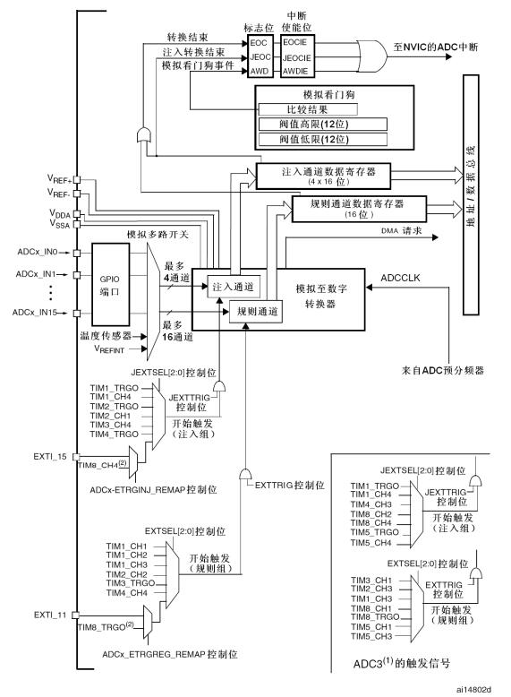
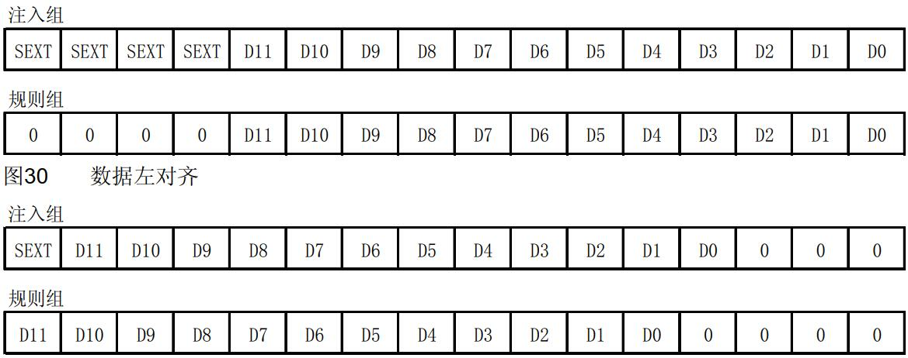
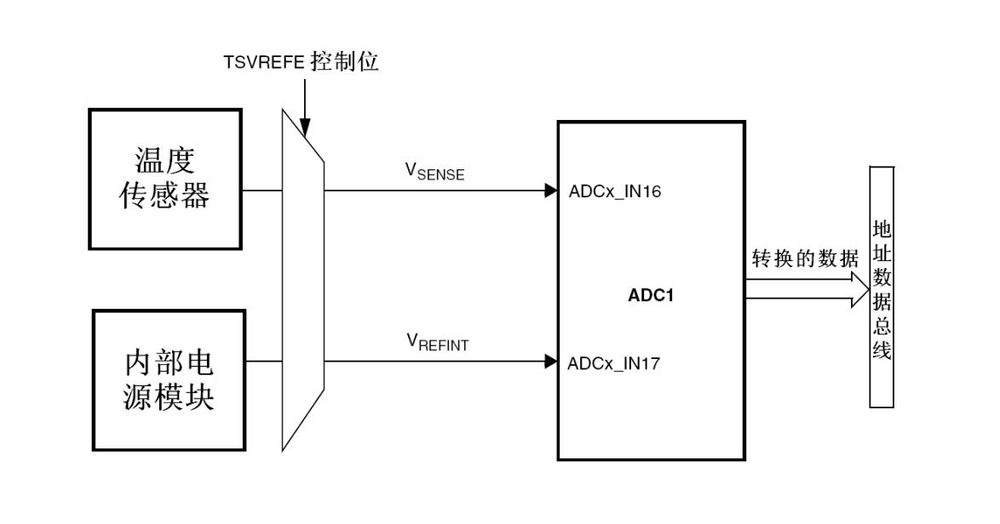

# 基本信息
* 课程名称：模数转换器 - ADC
* 讲师：谢胜
* 培训时间：2019/9/28 14:00-16:00
* 培训地点：T3 706
* 培训人数：14人

# 教学要点


# 教学重点


# 教学难点


# 教学准备
1. 学生准备：电脑、单片机、下载器
2. 教师准备：借教室

# 教学过程
## 第一步：ADC介绍
Analog-to-Digital Converter模数转换器，是一种逐次逼近型模拟数字转换器。它有多达18个通道，可测量16个外部和2个内部信号源。各通道的A/D转换可以单次、连续、扫描或间断模式执行。 ADC的结果可以左对齐或右对齐方式存储在16位数据寄存器中。

模拟看门狗特性允许应用程序检测输入电压是否超出用户定义的高/低阀值。

ADC的输入时钟不得超过14MHz，它是由PCLK2经分频产生。

ADC的特性如下：

* 12位分辨率
* 转换结束、注入转换结束和发生模拟看门狗事件时产生中断
* 单次和连续转换模式
* 从通道0到通道n的自动扫描模式
* 自校准
* 带内嵌数据一致性的数据对齐
* 采样间隔可以按通道分别编程
* 规则转换和注入转换均有外部触发选项
* 间断模式
* 双重模式(带2个或以上ADC的器件)
* ADC转换时间：
    ─ STM32F103xx增强型产品：时钟为56MHz时为1μs(时钟为72MHz为1.17μs)
    ─ STM32F101xx基本型产品：时钟为28MHz时为1μs(时钟为36MHz为1.55μs)
    ─ STM32F102xxUSB型产品：时钟为48MHz时为1.2μs
    ─ STM32F105xx和STM32F107xx产品：时钟为56MHz时为1μs(时钟为72MHz为1.17μs)
* ADC供电要求： 2.4V到3.6V
* ADC输入范围： VREF- ≤ VIN ≤ VREF+
* 规则通道转换期间有DMA请求产生。

## 第二步：ADC功能描述


名称 |信号类型| 注解
:--|:--|:--
VREF+| 输入，模拟参考正极| ADC使用的高端/正极参考电压， 2.4V ≤ VREF+ ≤ VDDA
VDDA| 输入，模拟电源| 等效于VDD的模拟电源且： 2.4V ≤ VDDA ≤ VDD(3.6V)
VREF-| 输入，模拟参考负极 |ADC使用的低端/负极参考电压， VREF- = VSSA
VSSA| 输入，模拟电源地| 等效于VSS的模拟电源地
ADCx_IN[15:0]| 模拟输入信号| 16个模拟输入通道

### 通道选择
ADC有16个多路通道。可以把转换组织成两组：规则组和注入组。在任意多个通道上以任意顺序进行的一系列转换构成成组转换。

* **规则组**由多达16个转换组成。
* **注入组**由多达4个转换组成。
* 温度传感器和通道ADC1_IN16相连接，内部参照电压VREFINT和ADC1_IN17相连接。可以按注入或规则通道对这两个内部通道进行转换。

> 温度传感器和VREFINT只出现在主ADC1中

### 单次转换模式
单次转换模式下， ADC只执行一次转换。一旦选择通道的转换完成：

* 如果一个规则通道被转换，转换数据被储存在16位ADC_DR寄存器中
* 如果一个注入通道被转换，转换数据被储存在16位的ADC_DRJ1寄存器中

转换完成后，会产生相应的中断（如果使能），然后ADC停止。

### 连续转换模式
在连续转换模式中，当前面ADC转换一结束马上就启动另一次转换。此模式可通过外部触发启动。

每个转换完成后数据存储位置与单次转换模式相同。

### 模拟看门狗
用户可设置电压的低阈值和高阈值，如果被ADC转换的模拟电压低于低阈值或高于高阈值，则模拟看门狗状态位被设置，产生中断。

模拟看门狗可以作用于1个或多个通道。

### 扫描模式
此模式用来扫描一组模拟通道。设置之后，ADC将自动扫描所有被选中的通道。在每个组的每个通道上执行单次转换。在每个转换结束时，同一组的下一个通道被自动转换。

如果设置了DMA位，在每次转换完成后，DMA控制器把规则组通道的转换数据传输到SRAM中。

### 间断模式
它可以用来执行一个短序列的n次转换(n<=8)。一个外部触发信号可以启动下一轮的n次转换，直到此序列所有的转换完成为止。

这里拿规则通道举例：

* n=3，被转换的通道 = 0、 1、 2、 3、 6、 7、 9、 10
* 第一次触发：转换的序列为 0、 1、 2
* 第二次触发：转换的序列为 3、 6、 7
* 第三次触发：转换的序列为 9、 10，并产生EOC事件
* 第四次触发：转换的序列 0、 1、 2

> 当以间断模式转换一个规则组时，转换序列结束后不自动从头开始。当所有子组被转换完成，下一次触发启动第一个子组的转换。在上面的例子中，第四次触发重新转换第一子组的通道 0、 1和2。

### 注入通道管理
规则组有16个，注入组有4个，注入组的优先级比规则组高，在执行规则组的时候注入组有权利打断并且执行自己的函数。

### 校准
ADC有一个内置自校准模式。校准可大幅减小因内部电容器组的变化而造成的准精度误差。在校准期间，在每个电容器上都会计算出一个误差修正码(数字值)，这个码用于消除在随后的转换中每个电容器上产生的误差。

> 建议在每次上电后执行一次校准
启动校准前， ADC必须处于关电状态超过至少两个ADC时钟周期

### DMA请求
因为规则通道转换的值储存在一个仅有的数据寄存器中，所以当转换多个规则通道时需要使用DMA，这可以避免丢失已经存储在ADC_DR寄存器中的数据。

只有在规则通道的转换结束时才产生DMA请求，并将转换的数据从ADC_DR寄存器传输到用户指定的目的地址。

> 只有ADC1和ADC3拥有DMA功能。由ADC2转化的数据可以通过双ADC模式，利用ADC1的DMA功能传输

### 数据对齐
数据可以左对齐或右对齐。



## 第三步：ADC的通道采样
ADC使用若干个ADC_CLK周期对输入电压采样，每个通道可以分别用不同的时间采样。

总转换时间如下计算：

$$T_{CONV} = 采样时间 + 12.5周期$$

## 第四步：ADC中断
规则和注入组转换结束时能产生中断，当模拟看门狗状态位被设置时也能产生中断。它们都有独立的中断使能位

> ADC1和ADC2的中断映射在同一个中断向量上，而ADC3的中断有自己的中断向量

## 第五步：ADC API
```c
/**
  * @brief  Enables ADC, starts conversion of regular group and transfers result
  *         through DMA.
  *         Interruptions enabled in this function:
  *          - DMA transfer complete
  *          - DMA half transfer
  *         Each of these interruptions has its dedicated callback function.
  * @note   For devices with several ADCs: This function is for single-ADC mode 
  *         only. For multimode, use the dedicated MultimodeStart function.
  * @note   On STM32F1 devices, only ADC1 and ADC3 (ADC availability depending
  *         on devices) have DMA capability.
  *         ADC2 converted data can be transferred in dual ADC mode using DMA
  *         of ADC1 (ADC master in multimode).
  *         In case of using ADC1 with DMA on a device featuring 2 ADC
  *         instances: ADC1 conversion register DR contains ADC1 conversion 
  *         result (ADC1 register DR bits 0 to 11) and, additionally, ADC2 last
  *         conversion result (ADC1 register DR bits 16 to 27). Therefore, to
  *         have DMA transferring the conversion results of ADC1 only, DMA must
  *         be configured to transfer size: half word.
  * @param  hadc: ADC handle
  * @param  pData: The destination Buffer address.
  * @param  Length: The length of data to be transferred from ADC peripheral to memory.
  * @retval None
  */
HAL_StatusTypeDef HAL_ADC_Start_DMA(ADC_HandleTypeDef* hadc, uint32_t* pData, uint32_t Length)
```

```c
/**
  * @brief  Conversion complete callback in non blocking mode 
  * @param  hadc: ADC handle
  * @retval None
  */
__weak void HAL_ADC_ConvCpltCallback(ADC_HandleTypeDef* hadc)
{
  /* Prevent unused argument(s) compilation warning */
  UNUSED(hadc);
  /* NOTE : This function should not be modified. When the callback is needed,
            function HAL_ADC_ConvCpltCallback must be implemented in the user file.
   */
}
```

## 第六步：温度传感器实验


温度传感器可以用来测量器件周围的温度(TA)。

温度传感器在内部和ADC1_IN16输入通道相连接，此通道把传感器输出的电压转换成数字值。

温度传感器模拟输入推荐采样时间是17.1μs。

> 注意： 必须设置TSVREFE位激活内部通道： ADC1_IN16(温度传感器)和ADC1_IN17(VREFINT)的转换

温度传感器输出电压随温度线性变化，由于生产过程的变化，温度变化曲线的偏移在不同芯片上会有不同(最多相差45°C)。

内部温度传感器更适合于检测温度的变化，而不是测量绝对的温度。如果需要测量精确的温度，应该使用一个外置的温度传感器。

$$T = \frac{V_{25} - V_{SENSE}}{Avg_{Slope}}$$

* $V_{25}$等于$V_{SENSE}$在25℃时的数值
* $Avg_{Slope}$等于温度与$V_{SENSE}$曲线的平均斜率

# 参考
* 《STM32中文参考手册》